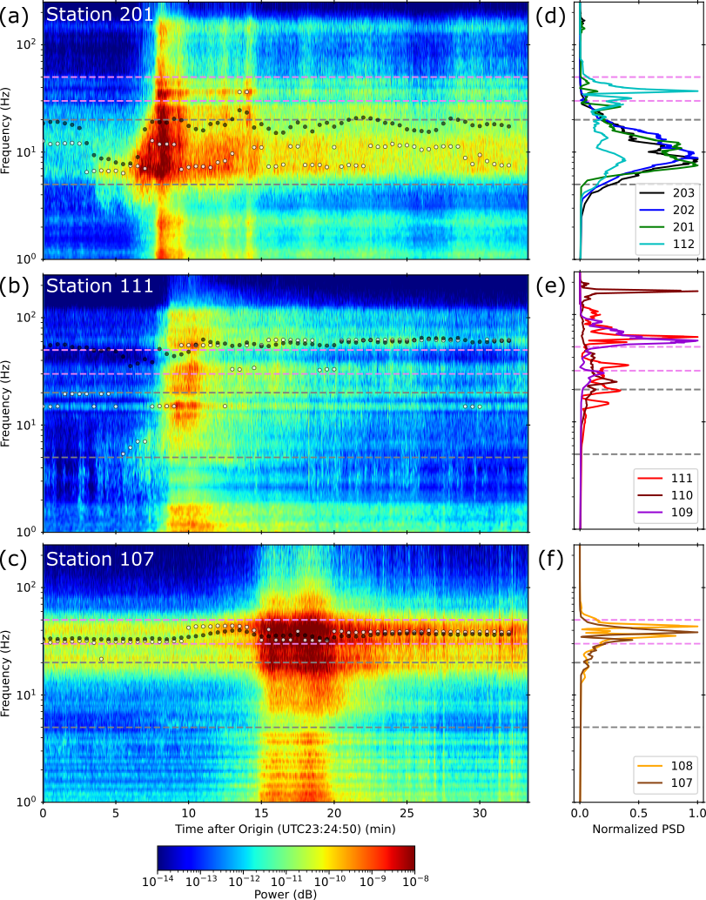
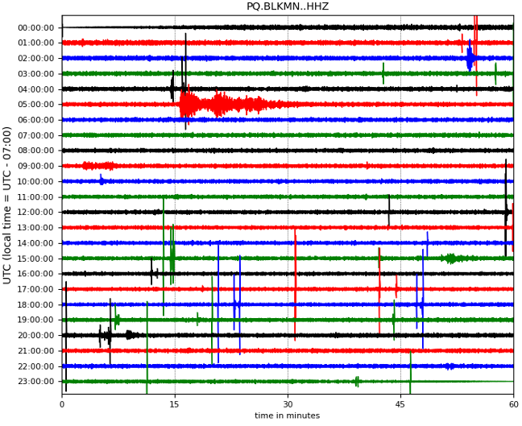

# Debris Flow Characterization at Mount Rainier

Tahoma Creek on the SW corner of Mount Rainier has seasonal debris flows accounting for a large portion of the debris flows occuring within Mount Rainier National Park. Our work leverages the permanent Rainier Lahar Detection System as well as seasonal deployments of seismic nodes in the Tahoma Creek drainage to characterize these debris flow events.

Current work in review at *Seismological Research Letters* looks at the seismic characteristics over the transition from debris flow to hyperconcentrated flow that occured during a debris flow in 2023. This behaviour appears to be characteristic of the Tahoma Creek drainage as subsequent debris flows in 2025 and 2026 show similar patterns. 

Our recent paper characterizing seismic channel properties in Tahoma Creek can be found [here](https://doi.org/10.1785/0220250071).   

<figure>
  
  <figcaption>
    Frequency characteristics of a debris flow in Tahoma Creek, Mount Rainier as it moves from (a and d) debris flow transport to (b and e) debris flow deposition and finally (c and f) hyperconcentrated flow. Taken from Biegel et al., 2026, SRL, in review.
  </figcaption>
</figure>

# Slope Hazards in Canadian Arctic

Global climate change disproportionately affects the high north where localized amplification of warming is sometimes 3 to 4 times greater than the global average. In combination with ice loss, these changes bring significant uncertainty about the nature and magnitude of slope hazards.

We are currently working on compiling a catalog of mass movement events at seismic stations throughout the Canadian Arctic.  

<figure>
  
  <figcaption>
    A 24-hour long seismic record from the Northwest Territories showing a significant number of mass movement events during the summer near Black Mountain, Northwest Territories, Canada.
  </figcaption>
</figure>

# Earthquakes and Secondary Slope Hazards in Alaska and Yukon

Tectonically active regions, like SW Yukon and SE Alaska, have the added complication of increased secondary hazards from earthquake-triggered landslides or other groundfailure events. In collaboration with the Yukon Geological Survey and the Natural Resources Canada, we are working on characterizing seismic risk in this region focused particularly on the Connector Fault.

Our recent report on the 6 Dec 2025 Yukon / Hubbard Glacier Earthquake can be found here:    

<figure>
  
  <figcaption>
    A photo of landslides, rockfall events, and glacial feature collapses as the result of the 6 December 2025 Yukon earthquake and subsequent seismic activity. PC/Yukon Geological Survey.
  </figcaption>
</figure>

